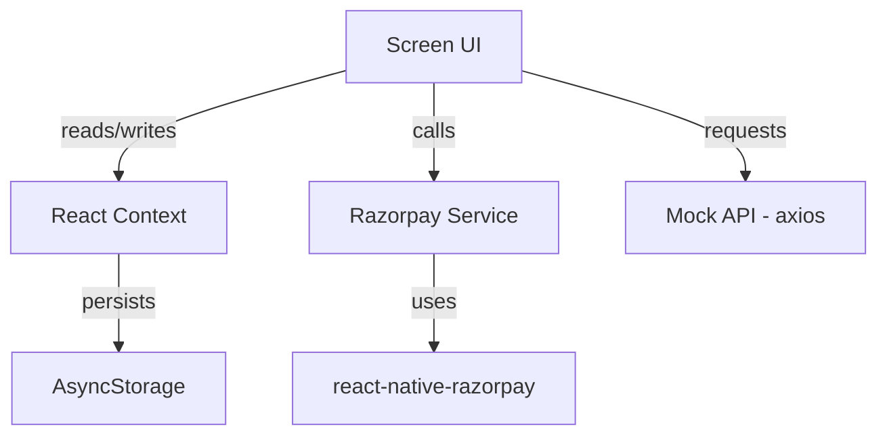

# Explorify – A React Native Shopping Companion 🛒


---

## What is Explorify?

Explorify is a **React Native CLI** mobile application that lets users browse a catalog of products, add items to a cart, and complete purchases via **Razorpay**. It showcases core mobile patterns such as navigation, context‑based state management, location awareness, and payment integration.

---

## Features

- Product listing with horizontal ad carousel and grid view (HomeScreen).
- Product detail view with image carousel and add‑to‑wishlist.
- Cart management and order summary screens.
- User profile and order‑tracking screens.
- Persistent storage of user‑selected items and Guest mode/Signed up user tracking using **AsyncStorage**.
- Location awareness via **@react-native-community/geolocation**.
- Razorpay payment gateway integration.
- Global alert handling through a custom **AlertContext**.
- Type‑safe data models written in **TypeScript**.

---

## Screenshots

| Screen | Description |
| --- | --- |
|  | HomeScreen – product carousel and grid layout |
|  | ProductDetails – image preview, description, and add‑to‑cart |
|  | CartScreen – list of selected items and checkout button |
|  | ProfileScreen – user info and order‑track navigation |

---

##  Architecture
### Folder Structure
```
src/
├─ components/          # Re‑usable UI components (e.g., CountBadge, CustomAlertModal)
├─ config/              # API configuration (currently mock data)
├─ constants/           # Theme constants – colors, typography
├─ context/             # React Context providers (Alert, Auth, Location, Product)
├─ data/                # Mock product data used during development
├─ fonts/               # Custom font files (Inter family)
├─ images/              # Icon assets used throughout the app
├─ screens/             # Screen components for navigation stack
├─ services/            # Razorpay service wrapper
└─ store/               # For shared state
```
### Data Flow (simplified)



---

##  Engineering Decisions

- **React Native CLI** – Provides direct access to native modules (e.g., geolocation, Razorpay) without the abstraction layer of Expo.
- **TypeScript** – Enforces strict typing across product, cart, and order models, catching shape mismatches at compile time.

- **React Context API** – Chosen over Redux for lightweight global state (auth, location, product, alerts) suitable for a medium‑sized app.
- **AsyncStorage** – Simple key‑value store used to persist the cart and wishlist across app launches.

- **Axios** – Standard HTTP client; currently used for mock data but ready for real API integration.
- **Razorpay SDK** – Native payment gateway delivering a secure checkout experience on Android/iOS.

- **@react-native-community/geolocation** – Provides device location for potential location‑based features.
- **React Navigation (native‑stack)** – Enables smooth native‑style transitions and deep linking.

---

##  Technical Challenges

| Problem | Solution | Lesson |
|---|---|---|
| **Integrating native Razorpay SDK** – required native module linking and handling asynchronous callbacks. | Wrapped the SDK in `services/razorpayService.ts`, exposed a promise‑based `processPayment` function, and unified success/failure handling via `AlertContext`. | Isolate native bridge code to keep UI components clean and testable. |

| **Managing global state without Redux** – needed a scalable approach for auth, location, and cart. | Implemented four Context providers, each with its own reducer; persisted cart data to AsyncStorage. | Context + reducer offers a lightweight alternative for apps with limited shared state. |

| **Handling permission flow for geolocation** – Android and iOS have different permission models. | Centralised permission request in `LocationContext`, showed user‑friendly alerts on denial, and fallback UI when location is unavailable. | Early permission handling prevents runtime crashes and improves user experience. |

| **Optimising large product lists** – FlatList caused occasional frame drops on low‑end devices. | Used `keyExtractor`, `initialNumToRender`, and `windowSize` tuning; memoised item render via `React.memo`. | Fine‑tuning FlatList parameters yields noticeable UI smoothness. |

| **Preventing duplicate submissions** – Users could tap checkout repeatedly before the payment UI loaded. | Added an `isProcessing` flag in `CartScreen` to disable the button until the promise resolves. | Guarding async actions avoids race conditions and duplicate orders. |

---

##  Error Handling

- **Global `AlertContext`** – Centralises error dialogs and toast messages; any component can trigger an alert.
- **Axios interceptors** – Capture network failures and forward error messages to `AlertContext`.
- **Duplicate‑action guards** – `isProcessing` flags prevent multiple concurrent payments or API calls.
- **Fallback UI** – Screens render a neutral placeholder view if required context data is missing, avoiding crashes.
- **Type safety** – TypeScript interfaces for product, cart, and order objects catch mismatches at compile time, reducing runtime errors.

---

##  Performance Optimisations

- Leveraged **FlatList** with `windowSize` and `removeClippedSubviews` for efficient rendering of the product grid.
- Images are bundled as local assets; no remote fetches during the demo, keeping load times short.
- Context reducers are pure functions, keeping state updates predictable and fast.
- Memoised reusable components (`CountBadge`, `CustomAlertModal`) to avoid unnecessary re‑renders.

---

##  Payment Flow

1. **CartScreen** – User taps **Checkout** button.
2. `processRazorpayPayment` from `services/razorpayService.ts` creates an order payload and invokes `RazorpayCheckout.open`.
3. **Success** – Razorpay returns a payment ID; the app navigates to `OrderPlacedScreen` with the ID.
4. **Failure** – Error is caught, and `AlertContext` displays a modal with the failure reason.
---

## Tech Stack

| Technology | Purpose |
|---|---|
| React Native CLI (0.87.1) | Native Android/iOS builds |
| TypeScript (6.0.3) | Static typing |
| React Navigation (native‑stack) | Screen routing |
| React Context API | Global state management |
| AsyncStorage | Persistent storage of cart & wishlist |
| Axios (1.20.0) | HTTP client (mock API) |
| Razorpay SDK (3.0.0) | Payment gateway |
| @react-native-community/geolocation | Device location |
| Jest & React Native Testing Library | Unit testing framework |
| ESLint & Prettier | Code linting & formatting |
| Yarn v4 | Package management |

---

##  Getting Started

```bash
# Clone the repo
git clone https://github.com/hahe050305/Explorify.git
cd Explorify

# Install dependencies
npm install

# Android
# Make sure Android SDK and an emulator/device are available
npm run android   # equivalent to `react-native run-android`

# iOS (macOS only)
# Xcode must be installed
npm run ios       # equivalent to `react-native run-ios`
```
> **Note**: The app uses native modules; therefore the Android/iOS toolchains must be set up according to the React Native CLI documentation.

---

##  Testing

The repository includes a basic Jest configuration but does **not** contain concrete test files yet. Adding unit and integration tests for context reducers, services, and screen components is a planned next step.

---

##  Future Improvements

- Add end‑to‑end tests with Detox for the full checkout flow.
- Replace mock product data with a real backend API.
- Implement push notifications for order status updates.
- Introduce offline‑first sync using Realm or WatermelonDB.
- Enhance accessibility (ARIA labels, screen‑reader support).
- Implement a Real-time Order Tracking System
---

##  What I Learned

- Integrating native payment SDKs requires careful asynchronous error handling and UI guards.
- Context‑based state can replace Redux for midsize apps, reducing boilerplate while keeping the codebase readable.
- Proper permission handling for location services improves reliability across Android/iOS.
- FlatList performance tuning is essential for smooth scrolling on lower‑end devices.

---

##  License
MIT – see `LICENSE` file.

---

*Explorify demonstrates practical mobile development patterns while keeping the codebase lean and type‑safe.*
